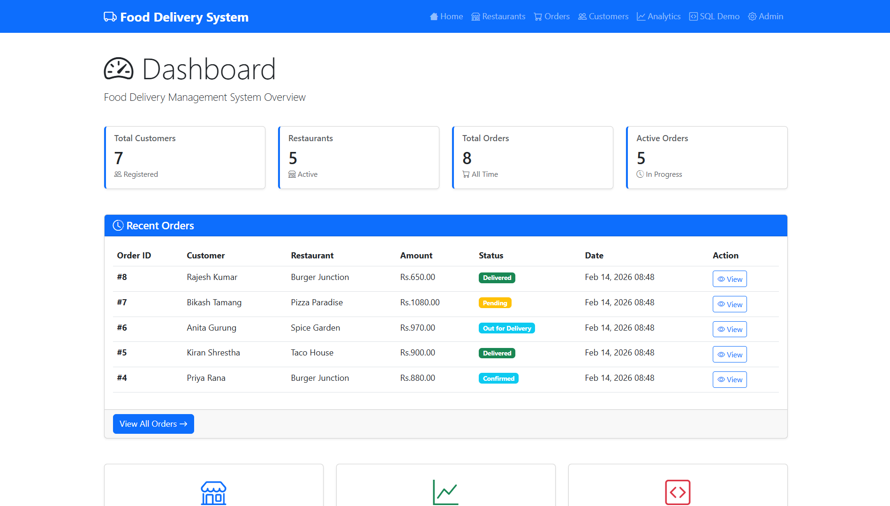
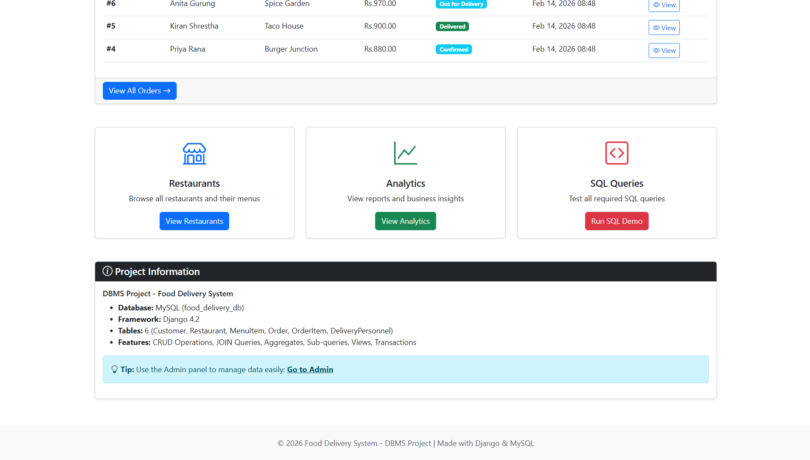
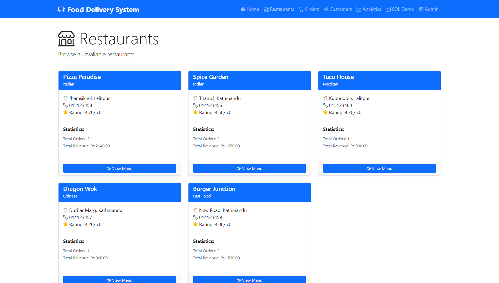
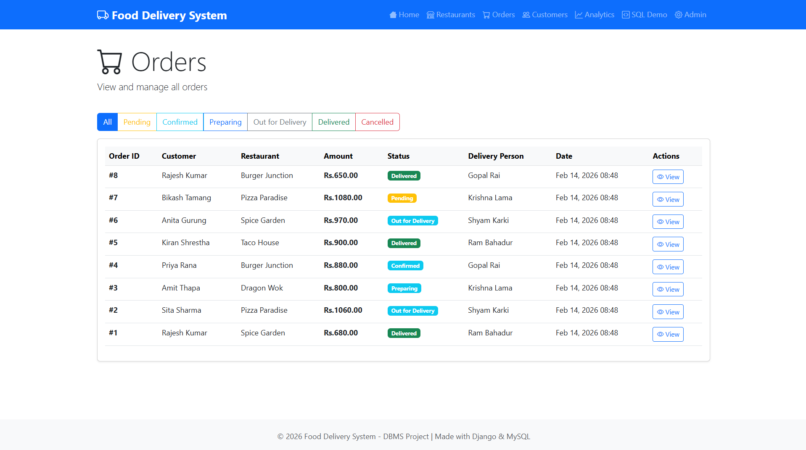
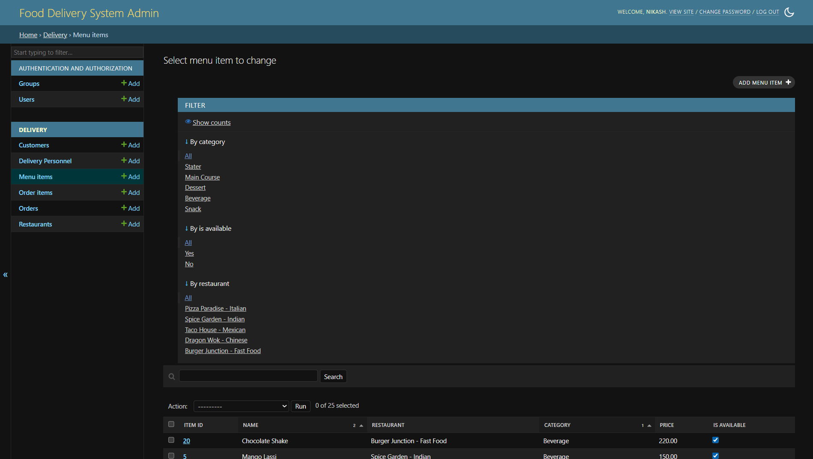
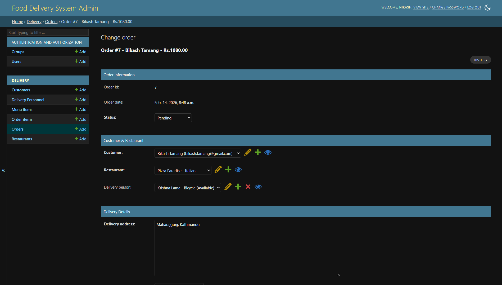
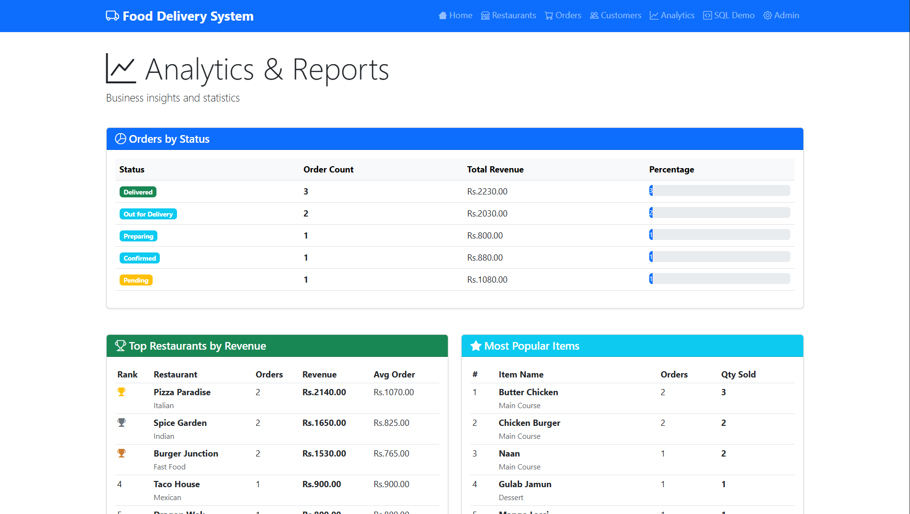

# Food Delivery System - DBMS Project

A complete **Database Management System** project built with **Django** and **MySQL** for managing online food delivery operations.

---

##  Table of Contents

- [Project Overview](#project-overview)
- [Features](#features)
- [Database Design](#database-design)
- [Technology Stack](#technology-stack)
- [Installation Guide](#installation-guide)
- [Usage](#usage)
- [SQL Queries Demonstrated](#sql-queries-demonstrated)
- [Project Structure](#project-structure)
- [Screenshots](#screenshots)
- [Contributors](#contributors)
- [License](#license)

---

## Project Overview

The **Food Delivery System** is a comprehensive web application that handles the complete workflow of online food ordering and delivery. The system manages customers, restaurants, menu items, orders, and delivery personnel with proper relational database design.

---

## Features

### Core Functionality
- **Customer Management** - Register and manage customer information
- **Restaurant Management** - Track restaurants with ratings and cuisine types
- **Menu Management** - Maintain menu items with prices and categories
- **Order Processing** - Place and track orders through multiple statuses
- **Delivery Tracking** - Assign and monitor delivery personnel

### Technical Features
-  Complete CRUD operations via Django Admin
-  Web-based dashboard with statistics
-  Analytics and reporting system
-  Live SQL query demonstration
-  Transaction management with COMMIT/ROLLBACK
-  Database views for complex queries
-  Responsive UI with Bootstrap 5

---

## Database Design

### Entity-Relationship Model

The system consists of **5 main entities** with the following relationships:
```
┌─────────────┐         ┌─────────────┐         ┌─────────────┐
│  CUSTOMER   │────1:M──│    ORDER    │────M:1──│ RESTAURANT  │
└─────────────┘         └─────────────┘         └─────────────┘
                              │                        │
                              │                        │
                              │ M:N                    │ 1:M
                              │                        │
                        ┌─────────────┐         ┌─────────────┐
                        │ ORDER_ITEM  │         │ MENU_ITEM   │
                        │  (Junction) │         └─────────────┘
                        └─────────────┘
                              
┌──────────────────┐
│ DELIVERY         │────1:M──│ ORDER │
│ PERSONNEL        │
└──────────────────┘
```

### Database Schema Summary

| Table | Primary Key | Foreign Keys | Records |
|-------|-------------|--------------|---------|
| **customer** | customer_id | - | 7 |
| **restaurant** | restaurant_id | - | 5 |
| **menu_item** | item_id | restaurant_id | 25 |
| **delivery_personnel** | delivery_id | - | 5 |
| **order_table** | order_id | customer_id, restaurant_id, delivery_id | 8 |
| **order_item** | order_item_id | order_id, menu_item_id | 20+ |

---

## Technology Stack

### Backend
- **Framework:** Django 6.0.2
- **Language:** Python 3.10+
- **ORM:** Django ORM

### Database
- **DBMS:** MySQL 8.0


### Frontend
- **HTML5** - Structure
- **CSS3** - Styling
- **Bootstrap 5** - UI Framework
- **JavaScript** - Interactivity

### Tools
- **Django Admin** - Data management interface
- **MySQL Workbench** - Database administration
- **Git** - Version control

---


<!-- ### Admin Panel -->

<!-- 1. Navigate to http://localhost:8000/admin/
2. Login with your superuser credentials
3. Manage all entities:
   - Add/Edit/Delete customers
   - Manage restaurants and menus
   - Process orders
   - Assign delivery personnel -->

### Web Interface

- **Dashboard** (`/`) - Overview with statistics
- **Restaurants** (`/restaurants/`) - Browse all restaurants
- **Orders** (`/orders/`) - View and filter orders
- **Customers** (`/customers/`) - Customer list with stats
- **Analytics** (`/analytics/`) - Business reports
- **SQL Demo** (`/sql-demo/`) - Live query execution

---

---

## Project Structure
```
food_delivery_system/
│
├── food_delivery/              # Main project directory
│   ├── __init__.py
│   ├── settings.py            # Django settings
│   ├── urls.py                # Main URL configuration
│   └── wsgi.py
│
├── delivery/                   # Main application
│   ├── migrations/            # Database migrations
│   ├── management/
│   │   └── commands/
│   │       └── populate_data.py  # Sample data script
│   ├── templates/
│   │   └── delivery/
│   │       ├── base.html      # Base template
│   │       ├── home.html      # Dashboard
│   │       ├── restaurants.html
│   │       ├── orders.html
│   │       ├── customers.html
│   │       ├── analytics.html
│   │       └── sql_demo.html
│   ├── __init__.py
│   ├── models.py              # Database models
│   ├── admin.py               # Admin configuration
│   ├── views.py               # View functions
│   ├── urls.py                # App URLs
│   └── apps.py
│
├── manage.py                   # Django management script
├── requirements.txt            # Python dependencies
├── README.md                   # This file
└── .gitignore
```

## UI

### Dashboard



*Main dashboard showing system statistics and recent orders*

### Restaurant List

*Browse all restaurants with ratings and cuisine types*

### Order Management

*View and filter orders by status*

### SQL Demo


*Live execution of SQL queries with results*

### Admin Panel



*Django admin interface for data management*

### Analytics Dashboard


*Business insights and performance metrics*

---

<div align="center">

**Made with ❤️ for web development**

</div>